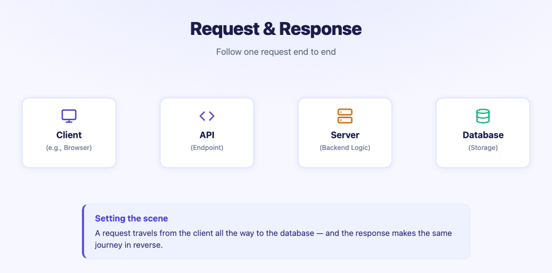
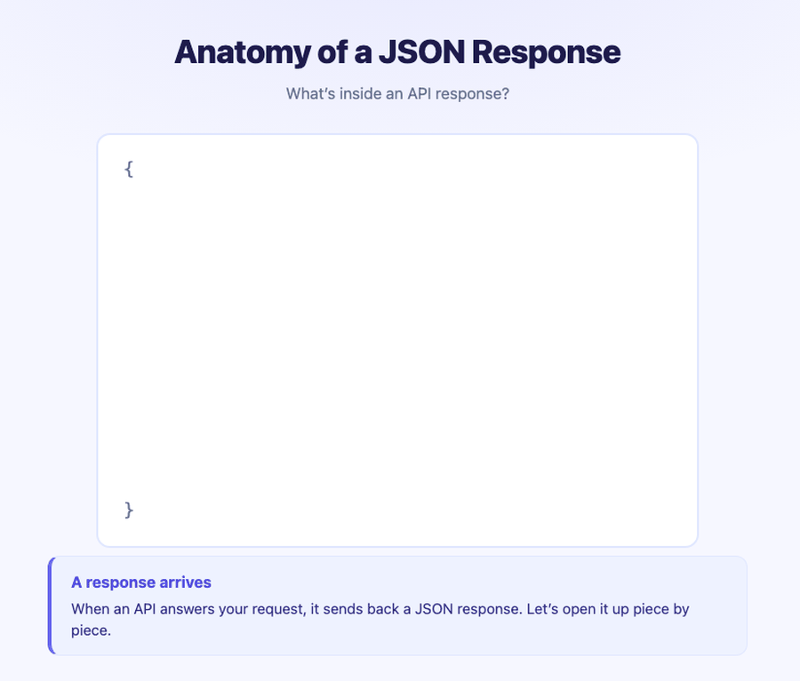

```{r setup, include=FALSE}
knitr::opts_chunk$set(eval = FALSE)
```

## Welcome & Orientation

Welcome to the **API Workshop**! Over the next two days (4 hours total), we will build a strong foundation in working with APIs — from understanding the data format they use, to making real requests and handling real responses.

**Workshop Structure:**

| Day | Time | Session | Focus |
|-----------------|-----------------|----------------------|-----------------|
| Day 1 | 8:00–9:00 AM | Session 1 | JSON Fundamentals & Request/Response |
| Day 1 | 9:00–10:00 AM | Session 2 | CRUD, HTTP Methods, URL Anatomy & Dummy Server |
| Day 2 | 9:00–10:00 AM | Session 3 | Weather API — Setup, Current Weather, Geocoding |
| Day 2 | 10:00–11:00 AM | Session 4 | Historical Weather, Visualization & Wrap-Up |

**Tool Note:** We will be working in **Positron** throughout. You can follow along in RStudio, but Positron will give you a richer experience for this workshop.

::: callout-important
## 🎯 The One Goal of This Workshop

Everything we do — today and tomorrow — builds toward **one skill**:

> **Make a request to an API, then format the response into something we can analyze.**

If you ever feel overwhelmed, come back to this sentence. Every part of every session is just one small step toward it.
:::

------------------------------------------------------------------------

## Part 1: What is an API?

**API** stands for **Application Programming Interface**. At its core, an API is a way for software to communicate with other software. In data science, we use APIs to programmatically request data from external servers — weather services, sports databases, social media platforms, and more.

### Watch First: The Restaurant Analogy

Use the buttons to step through the animation — go at your own pace, pause, or replay any step.

```{=html}
<div id="restaurant-stepper" style="border:2px solid #d0d7de; border-radius:12px; padding:1rem 1.25rem; margin:1rem 0; background:#fafbfc;">
  <div style="display:flex; justify-content:space-between; gap:.5rem; text-align:center; margin-bottom:1rem; flex-wrap:wrap;">
    <div class="rs-actor" id="rs-client" style="flex:1; min-width:110px; padding:.75rem .25rem; border-radius:10px; border:2px solid transparent; transition:all .4s;">
      <div style="font-size:2.2rem;">🙋</div><strong>You</strong><br><small>the Client</small>
    </div>
    <div style="align-self:center; font-size:1.4rem; color:#8b949e;">⇄</div>
    <div class="rs-actor" id="rs-waiter" style="flex:1; min-width:110px; padding:.75rem .25rem; border-radius:10px; border:2px solid transparent; transition:all .4s;">
      <div style="font-size:2.2rem;">🤵</div><strong>Waiter</strong><br><small>the API</small>
    </div>
    <div style="align-self:center; font-size:1.4rem; color:#8b949e;">⇄</div>
    <div class="rs-actor" id="rs-kitchen" style="flex:1; min-width:110px; padding:.75rem .25rem; border-radius:10px; border:2px solid transparent; transition:all .4s;">
      <div style="font-size:2.2rem;">👨‍🍳</div><strong>Kitchen</strong><br><small>the Server</small>
    </div>
    <div style="align-self:center; font-size:1.4rem; color:#8b949e;">⇄</div>
    <div class="rs-actor" id="rs-fridge" style="flex:1; min-width:110px; padding:.75rem .25rem; border-radius:10px; border:2px solid transparent; transition:all .4s;">
      <div style="font-size:2.2rem;">🧊</div><strong>Fridge</strong><br><small>the Database</small>
    </div>
  </div>
  <div id="rs-caption" style="min-height:3.2em; font-size:1.05rem; text-align:center; padding:.5rem; background:#fff; border-radius:8px; border:1px solid #d0d7de;"></div>
  <div style="display:flex; justify-content:center; align-items:center; gap:.5rem; margin-top:.85rem; flex-wrap:wrap;">
    <button id="rs-restart" class="rs-btn">⏮ Restart</button>
    <button id="rs-back" class="rs-btn">◀ Back</button>
    <span id="rs-dots" style="letter-spacing:.35em; font-size:1rem; color:#8b949e;"></span>
    <button id="rs-next" class="rs-btn">Next ▶</button>
    <button id="rs-play" class="rs-btn" style="min-width:6.5em;">▶ Play</button>
  </div>
</div>
<style>
  .rs-btn { border:1px solid #d0d7de; background:#fff; border-radius:8px; padding:.35rem .8rem; cursor:pointer; font-size:.9rem; }
  .rs-btn:hover { background:#f3f4f6; }
  .rs-on { border-color:#0969da !important; background:#ddf4ff !important; }
</style>
<script>
(function() {
  const steps = [
    { text: "<strong>Step 1:</strong> You (the <strong>client</strong>) sit down and read the <strong>menu</strong> — the menu is the API documentation. It tells you what you are allowed to order.", on: ["rs-client"] },
    { text: "<strong>Step 2:</strong> You <strong>make a request</strong> — the client places an order with the waiter. 📝 <em>This is the request!</em>", on: ["rs-client", "rs-waiter"] },
    { text: "<strong>Step 3:</strong> The <strong>waiter (API)</strong> carries your order to the <strong>kitchen (server)</strong>. You never walk into the kitchen yourself.", on: ["rs-waiter", "rs-kitchen"] },
    { text: "<strong>Step 4:</strong> The <strong>kitchen (server)</strong> pulls ingredients from the <strong>fridge (database)</strong> and prepares your dish.", on: ["rs-kitchen", "rs-fridge"] },
    { text: "<strong>Step 5:</strong> The waiter brings your meal back to the table. 🍽 <em>This is the response!</em>", on: ["rs-waiter", "rs-client"] }
  ];
  let i = 0, timer = null;
  const $ = id => document.getElementById(id);
  function render() {
    document.querySelectorAll("#restaurant-stepper .rs-actor").forEach(el => el.classList.remove("rs-on"));
    steps[i].on.forEach(id => $(id).classList.add("rs-on"));
    $("rs-caption").innerHTML = steps[i].text;
    $("rs-dots").textContent = steps.map((_, k) => k === i ? "●" : "○").join("");
  }
  function stopPlay() { if (timer) { clearInterval(timer); timer = null; $("rs-play").textContent = "▶ Play"; } }
  $("rs-next").onclick = () => { stopPlay(); i = (i + 1) % steps.length; render(); };
  $("rs-back").onclick = () => { stopPlay(); i = (i - 1 + steps.length) % steps.length; render(); };
  $("rs-restart").onclick = () => { stopPlay(); i = 0; render(); };
  $("rs-play").onclick = () => {
    if (timer) { stopPlay(); return; }
    $("rs-play").textContent = "⏸ Pause";
    timer = setInterval(() => { i = (i + 1) % steps.length; render(); }, 2600);
  };
  render();
})();
</script>
```

### Now in Words

Here is the same story, written out:

-   **You** (the client) look at the menu and **make a request** — you place your order.
-   **The waiter** (the API) carries your request to the kitchen.
-   **The kitchen** (the server, with its fridge — the database) prepares your food.
-   **The waiter** brings back your meal (the **response**).

The key insight: you never walk into the kitchen yourself. The API is the controlled interface that lets you interact with the data source. And notice who starts everything: **the client makes the request.** Nothing happens until you order.

::: callout-tip
## 🎯 Goal Check

In this analogy, our workshop goal is simply: *place an order (make a request) and turn the meal that arrives (the response) into something we can analyze.*
:::

#### ———————

### Q1. {.unnumbered}

**(Fill in the Blank):** In the restaurant analogy, the waiter plays the role of the \_\_\_\_\_\_\_\_.


#### ———————

#### ———————

### Q2. {.unnumbered}

**(Multiple Choice):** What is the primary utility of a web API for a data analyst?

a)  To create visual websites for data projects.
b)  To store large CSV files in the cloud.
c)  To design the database structure for a server.
d)  To allow programmatic, repeatable, and direct access to live data from an external source.
e)  To replace the need for any programming language.


#### ———————

------------------------------------------------------------------------

## Part 2: API Data Flow

Let's go deeper into the architecture — same story as the restaurant, now with the technical names.

### Watch First

{fig-alt="Animation showing API request traveling from Client through API Endpoint to Server and Database, then the response returning the same path in reverse"}

### Now in Words

The animation traces a single API call from start to finish. There are four components in the chain: the **Client** (your R script or browser), the **API** (the endpoint — the "front door"), the **Server** (backend logic that processes the request), and the **Database** (where the actual data lives).

**Request direction:** Client (request) → API → Server → Database

**Response direction:** Client ← API ← Server (response) ← Database

The request moves left to right; the response travels the same path in reverse.

::: callout-note
## Key Observations

-   The **client** is your R script or browser — anything making the request.
-   The **API** is the endpoint — the "front door" of the data service.
-   The **server** processes the request and queries the **database**.
-   The response travels back the same path.
-   A client and server can exist on the same computer — this is common in local development.
:::

::: callout-tip
## 🎯 Goal Check

This chain is exactly what happens every time we run our workshop goal: *the client (our R script) makes a request, and a response comes back for us to analyze.*
:::

#### ———————

### Visual Check — API Data Flow. {.unnumbered}

**(Multiple Choice):** In the animation, the API sits between the Client and the Server. What best describes the API's role in this chain?

a)  It stores the data permanently.
b)  It runs the backend logic that queries the database.
c)  It acts as a gateway — receiving requests from the client and routing them to the server.
d)  It is the same as the database.
e)  It draws the plots at the end of the analysis.


#### ———————

#### ———————

### Q3. {.unnumbered}

**(Fill in the Blank):** A request travels: Client → \_\_\_\_\_\_\_\_ → Server → Database.


#### ———————

#### ———————

### Q4. {.unnumbered}

**(Fill in the Blanks — the restaurant story):** Fill in each blank with one word from: *client, waiter, kitchen, fridge, response.*

> I (the \_\_\_\_\_) look at the menu and place my order with the \_\_\_\_\_. My order is carried to the \_\_\_\_\_, which pulls ingredients from the \_\_\_\_\_. The finished dish comes back to my table — that dish is the \_\_\_\_\_.


#### ———————

#### ———————

### Q5. {.unnumbered}

**(Multiple Choice — Callback to Q1):** In the restaurant analogy, the API documentation is most analogous to:

a)  The kitchen equipment
b)  The cash register
c)  The table number
d)  The chef's secret recipe book
e)  The menu


#### ———————

------------------------------------------------------------------------

## Part 3: Requests and Responses

Now let's zoom in on the two key actions: **requests** and **responses**. We'll keep this simple — the details come in Session 2.

### What is a Request?

A request is the client *asking* for information. Here is the one thing to remember today:

> **A request is written as a URL — a web address.**

That's it. When we want data from an API, we build a web address that describes what we want, and we send it. In Session 2 we will dissect exactly how that web address is put together, piece by piece.

*(One aside for later: some APIs also ask you to include an ID called an **API key** — like showing a library card. The weather API we use in this workshop is free and doesn't need one, so we can set that idea aside for now.)*

### What is a Response?

The server returns a **response** which contains:

-   **Data** — the actual information you requested (temperature, artist name, forecast, etc.)
-   **Metadata** — information *about* the response (timestamps, units, etc.)
-   **Status code** — tells you whether the request was successful (e.g., `200 OK`)

This information is traditionally provided in **JSON format** — which is exactly what Part 4 is about.

::: callout-tip
## 🎯 Goal Check

Two halves of our goal, side by side: the **request** is a URL we send; the **response** is what we'll format into something we can analyze.
:::

#### ———————

### Q6. {.unnumbered}

**(Fill in the Blank):** A request is written as a \_\_\_\_\_\_\_\_ — a web address that asks the API for specific information.


#### ———————

#### ———————

### Q7. {.unnumbered}

**(Multiple Choice):** A response from an API contains which three things?

a)  Data, metadata, and a status code
b)  A URL, an API key, and a password
c)  A plot, a table, and a summary
d)  HTML, CSS, and JavaScript
e)  Rows, columns, and cell values


#### ———————

------------------------------------------------------------------------

## Part 4: Anatomy of a JSON Response

Now let's focus on the **response** — specifically, what it looks like. API responses are almost always formatted as **JSON** (JavaScript Object Notation).

### Watch First

{fig-alt="Animation revealing the anatomy of a JSON response: the full body opens as curly braces, then data, metadata, and status code zones are highlighted in sequence"}

### Now in Words

The animation reveals the layers of a JSON response, one at a time:

1.  The entire thing — everything the server sends back — is called the **Body** (or **Content**). It is wrapped in curly braces `{ }`.
2.  Inside that body, the content is divided into three zones:
    -   **Data**: what we actually wanted (temperature, city name, coordinates)
    -   **Metadata**: information about the response (timestamps, units)
    -   **Status code**: tells us if the request worked

Take this slowly — this structure will show up in *every* response for the rest of the workshop.

::: callout-tip
## 🎯 Goal Check

The response body is the raw material. Our goal — "format the response into something we can analyze" — means taking this JSON and turning it into an R data frame.
:::

#### ———————

### Quick Checks — JSON Response Anatomy. {.unnumbered}

**(Fill in the Blanks):** One or two words each.

1.  Everything the server sends back is called the body or content, and it is wrapped in curly \_\_\_\_\_\_\_\_.
2.  The three zones inside the body are the data, the \_\_\_\_\_\_\_\_, and the status code.
3.  The \_\_\_\_\_\_ \_\_\_\_\_\_ tells us whether the request worked.


#### ———————

### JSON Structure: Key-Value Pairs

JSON organizes data using **key-value pairs**. Here's a simple example:

``` json
{
  "city": "San Luis Obispo",
  "temperature": 72,
  "units": "imperial",
  "conditions": "clear sky"
}
```

Key features of JSON:

-   Data is wrapped in curly braces `{ }`
-   Each entry is a `"key": value` pair
-   Values can be strings, numbers, booleans, arrays, or **nested objects**
-   Nested objects are JSON inside JSON — like a list within a list

### Nested JSON Example

``` json
{
  "city": "San Luis Obispo",
  "coordinates": {
    "lat": 35.28,
    "lon": -120.66
  },
  "weather": {
    "main": "Clear",
    "temp": 72,
    "humidity": 45
  }
}
```

::: callout-important
## Thinking in R Terms

In R, a JSON response becomes a **named list** — potentially containing other named lists inside it. This is what we mean by "nested." When we flatten it with `as.data.frame()`, nested keys become column names like `coordinates.lat` or `weather.temp`.
:::

#### ———————

### Q8. {.unnumbered}

**(Multiple Choice):** The JSON data format, commonly used in API responses, organizes information using what fundamental structure?

a)  Rows and columns
b)  A nested series of bullet points
c)  Key-value pairs
d)  Formatted paragraphs of text
e)  Comma-separated values


#### ———————

#### ———————

### Q9. {.unnumbered}

**(Fill in the Blank):** In R, a JSON object `{ }` becomes a named \_\_\_\_\_\_\_\_.


#### ———————

#### ———————

### Q10. {.unnumbered}

**(Fill in the Blank — using the nested example above):** If you flatten the nested JSON example with `as.data.frame()`, the column holding the latitude value would be named \_\_\_\_\_\_\_\_.


#### ———————

------------------------------------------------------------------------

## Part 5: Status Codes

Status codes tell you what happened with your request. They are grouped by category:

| Range   | Category      | Meaning                               |
|---------|---------------|---------------------------------------|
| **1xx** | Informational | Request received, processing...       |
| **2xx** | Success       | Request was successful                |
| **3xx** | Redirect      | Resource moved to a different URL     |
| **4xx** | Client Error  | Something wrong with *your* request   |
| **5xx** | Server Error  | Something wrong on the *server's* end |

**The most important ones for data work:**

-   **200 OK** — Success! You got your data.
-   **401 Unauthorized** — Your credentials (e.g., an API key) are missing or invalid.
-   **403 Forbidden** — You don't have permission to access this resource.
-   **404 Not Found** — The endpoint or resource doesn't exist.
-   **429 Too Many Requests** — You've hit the rate limit.
-   **500 Internal Server Error** — The server broke; not your fault.

::: callout-note
## Practical Tip

In most data API work, your goal is to get a **200** response. If you don't, the status code tells you *where* to look for the problem — your request (4xx) or their server (5xx).
:::

::: callout-tip
## 🎯 Goal Check

The status code is the first thing we check after making a request: a **200** means "the response arrived — go ahead and format it for analysis."
:::

#### ———————

### Q11. {.unnumbered}

**(Fill in the Blank):** A status code in the 4xx range means the mistake is on the \_\_\_\_\_\_\_\_ side; a 5xx code means the problem is on the \_\_\_\_\_\_\_\_ side.


#### ———————

#### ———————

### Q12. {.unnumbered}

**(Multiple Choice):** Your script fails with a `404 Not Found` status code. What is the most likely source of the error?

a)  The weather company's server crashed.
b)  Your internet is disconnected.
c)  R is not installed correctly.
d)  The database deleted your account.
e)  The URL in your request is incorrect or misspelled.


#### ———————

#### ———————

### Q13. {.unnumbered}

**(Multiple Choice — Callback to Q8):** If you receive a response with a status code of `200` and the body contains JSON, which of the following would you expect to find in that response?

a)  An error message explaining what went wrong
b)  Key-value pairs containing the data you requested
c)  A redirect URL to a different API
d)  An empty response with no content
e)  A request for payment


#### ———————

------------------------------------------------------------------------

## Session 1 Recap

In this session, we covered the **conceptual foundation** for working with APIs:

1.  **What an API is** — a controlled interface for software-to-software communication (the waiter!)
2.  **API data flow** — Client → API → Server → Database (and back)
3.  **Requests vs. Responses** — a request is a URL you send; a response is what comes back
4.  **JSON format** — key-value pairs, nesting, and how it maps to R data structures
5.  **Status codes** — how to diagnose what happened with your request

🎯 And the goal, one more time: **make a request, then format the response into something we can analyze.** Today was the vocabulary; tomorrow we do it for real.

**Up next in Session 2:** We'll learn about CRUD operations, HTTP methods (GET vs. POST), URL anatomy, and make our first requests to a dummy server!

------------------------------------------------------------------------

## During the Break {.unnumbered}

Before Session 2 starts:

-   **Questions?** Come up and ask — Meg and I will be here for the whole break.
-   **Did you finish?** Check yourself:
    -   [ ] I can name the four components: client, API, server, database
    -   [ ] I answered the questions in Parts 1–5 (peek at the answers if you need)
    -   [ ] I can say the workshop goal in one sentence
-   If you finished everything, replay the restaurant animation and try narrating the five steps using the technical words (client, API, server, database, response).
