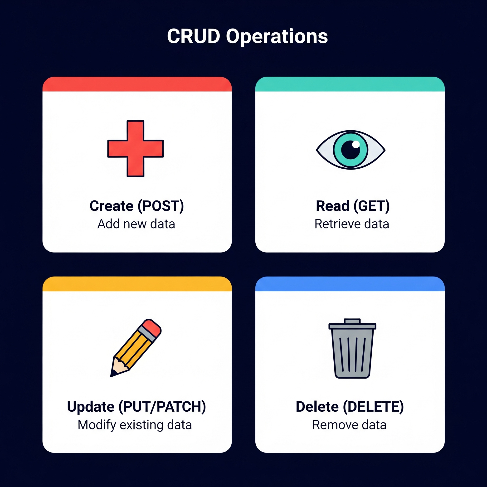
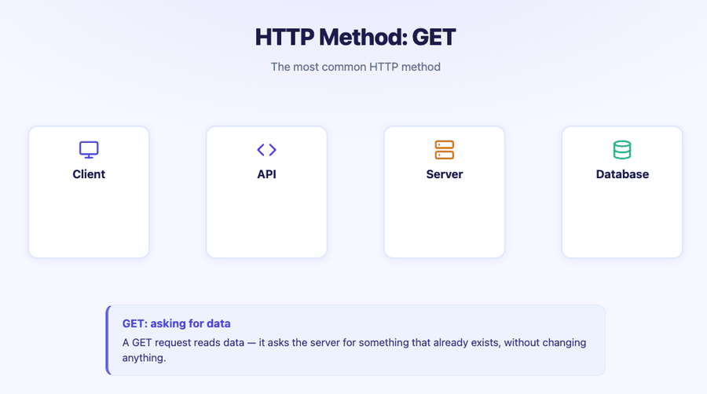
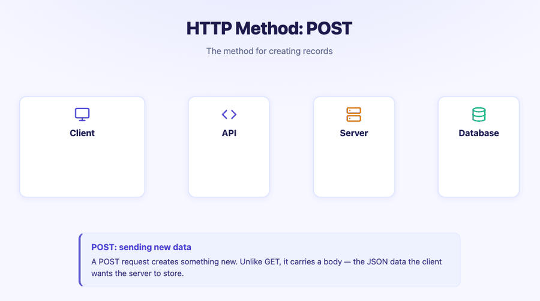

```{r setup, include=FALSE}
knitr::opts_chunk$set(eval = FALSE)
```


## Recap from Session 1

In Session 1 (*API Mechanics & Response Fundamentals*), we established the conceptual foundation:

- APIs are interfaces for software communication
- Data flows: Client → API → Server → Database (and back)
- Responses come as JSON (key-value pairs, nested structures)
- Status codes tell us if the request succeeded (200) or not (4xx, 5xx)

Now we're going to put that knowledge into action — understanding *how* we interact with APIs and *what* those interactions look like.

::: {.callout-important}
## 🎯 The One Goal, Again

> **Make a request to an API, then format the response into something we can analyze.**

Session 1 gave us the vocabulary. This session answers one question: **how exactly do we write a request?** (Answer: it's a URL — and by the end of this hour you'll be able to read one like a sentence.)
:::


---


## Part 1: The CRUD Framework

### Look First

{fig-alt="Four-quadrant image showing CRUD operations: Create (POST) with a plus icon, Read (GET) with an eye icon, Update (PUT/PATCH) with a pencil icon, Delete (DELETE) with a trash can icon"}

### Now in Words

What type of client requests can we make? The **CRUD framework** organizes the four fundamental operations. The image maps each CRUD operation to a visual icon: a **plus sign** for Create/POST (adding something new), an **eye** for Read/GET (looking at existing data), a **pencil** for Update/PUT-PATCH (editing something), and a **trash can** for Delete/DELETE (removing it).

| CRUD Operation | HTTP Method | Description |
|---------------|-------------|-------------|
| **C**reate | `POST` | Submit new data to the server |
| **R**ead | `GET` | Retrieve existing data from the server |
| **U**pdate | `PUT` / `PATCH` | Modify existing data on the server |
| **D**elete | `DELETE` | Remove a resource from the server |

::: {.callout-important icon="false"}
## 📖 Definition — HTTP

**HTTP** (**HyperText Transfer Protocol**) is the standard set of rules for sending requests and responses across the web. The methods in the table — GET, POST, PUT, DELETE — are HTTP's built-in verbs: they announce *what kind of action* a request is asking for.
:::

::: {.callout-note}
## For Data Science
In data science, **Read (GET)** is by far the most common operation. We're typically *pulling* data, not writing to databases. As a data scientist, the eye (Read/GET) quadrant will cover the vast majority of your API work.
:::

::: {.callout-tip}
## 🎯 Goal Check
Our workshop goal — *make a request, format the response* — lives almost entirely in the **Read (GET)** quadrant. Everything we do tomorrow is a GET.
:::


#### ———————
### Visual Check — CRUD Operations. {.unnumbered}

**(Multiple Choice):** A social media app lets users edit their display name. Based on the image above, which CRUD operation and HTTP method does that action map to?

a) Create — POST
b) Read — GET
c) Delete — DELETE
d) Update — PUT/PATCH
e) Read — POST

#### ———————


#### ———————
### Q1. {.unnumbered}

**(Fill in the Blank):** The HTTP method used to *read* (retrieve) data from a server is \_\_\_\_\_\_\_\_.

#### ———————


#### ———————
### Q2. {.unnumbered}

**(Multiple Choice):** Which CRUD operation is most commonly used in data science when working with APIs?

a) Read
b) Create
c) Update
d) Delete
e) All four equally

#### ———————


---


## Part 2: GET & POST Requests

A `GET` request is all about **retrieving** data. You're asking the server: "Give me this information."

### Watch First

{fig-alt="Animation of GET /users/42 request: Client sends request right through API to Server and Database, then data flows back left to the Client"}

### Now in Words

The animation shows a GET request for the resource `GET /users/42`. The request originates at the **Client** and travels through the **API** to the **Server** and **Database**. Notice two things: first, the request carries only a path (`/users/42`) — no data payload. Second, the response brings data back to the client while nothing new is written to the database.

Here is the flow of a GET request:

1. **Client** constructs a request for a resource.
2. **API** receives and validates the client's request.
3. **Server** locates the requested data within the database.
4. **Client** receives the requested data from the server.

::: {.callout-note}
## GET Characteristics

- The request parameters are encoded **in the URL** (visible in the address bar)
- GET requests are meant to be **read-only** — they don't change data on the server
- They are **idempotent** — making the same request multiple times gives the same result
:::

::: {.callout-tip}
## 🎯 Goal Check
"Make a request" in our goal sentence means, concretely: **send a GET request** — a URL asking for data.
:::


#### ———————
### Visual Check — GET Request. {.unnumbered}

**(Fill in the Blank):** The animation shows `GET /users/42`. If you changed the request to `GET /users/7`, the only thing that changes is the \_\_\_\_\_\_\_\_ — the method, the flow, and everything else stay the same.

#### ———————


#### ———————
### Q3. {.unnumbered}

**(Multiple Choice):** Which of the following is an example of a task a data scientist would do with a **GET** request?

a) Deleting old records from a company database
b) Uploading a new profile photo
c) Posting a comment on a forum
d) Changing your account password
e) Retrieving the top 10 most popular articles from the New York Times API

#### ———————


### POST Requests (Optional)

A `POST` request is about **sending** new data to the server. You're telling the server: "Here's something new — store it."

**Live decision, based on time:** everything we do tomorrow is GET, so this is a flex. Pick a tab — the quick version takes one minute; the full walkthrough about ten.

::: {.panel-tabset}

### ⏭ Quick Version (\~1 min)

One idea is enough: **POST sends new data to the server**, and that data travels in the request **body** — unlike GET, which carries everything in the URL and only *asks* for data.

Think of it this way: **GET is borrowing a book from the library. POST is donating a new book to it.**

That's all this workshop needs — if we skipped the details today, come back to the Full Walkthrough tab after the workshop.

### 📮 Full Walkthrough (\~10 min)

#### Watch First

{fig-alt="Animation of POST /users request: Client holds JSON payload with name and email, data travels right through API to Server and Database, then confirmation returns to Client"}

#### Now in Words

The animation shows a POST request sending `POST /users` with a JSON payload `{ "name": "Maya", "email": "maya@example.com" }`. Compare this carefully to the GET animation: with GET, data flowed *from* the server *to* the client. With POST, data originates *at the client* and moves *toward* the server. The client is the source; the server is the destination.

Here is the flow of a POST request:

1. **Client** sends new data within the request body.
2. **API** receives and validates the client's new data.
3. **Server** creates a new record in the database.
4. **Client** receives a confirmation for the new record.

::: {.callout-important}
## GET vs. POST — Key Difference
- **GET** sends parameters *in the URL* — you're asking for data.
- **POST** sends data *in the request body* — you're submitting new data.

Think of it this way: GET is reading a book from the library. POST is donating a new book to the library.
:::


#### ———————
#### Visual Check — POST Request. {.unnumbered}

**(Multiple Choice):** In the POST animation, the JSON payload `{ "name": "Maya", ... }` travels from the Client to the Server. Where does this data live in the request?

a) In the URL query string, just like GET parameters.
b) In the request **body** — unlike GET, which puts parameters in the URL.
c) In a separate file attachment.
d) In the status code.
e) In the database before the request is even sent.

#### ———————


#### ———————
#### Q4. {.unnumbered}

**(Multiple Choice):** Which of the following data science tasks would most likely require a **POST** request instead of a GET request?

a) Retrieving the current temperature for a city.
b) Getting a list of your public repositories from the GitHub API.
c) Submitting a new tweet through the X (formerly Twitter) API.
d) Looking up the coordinates for a specific address.
e) Downloading yesterday's stock prices.

#### ———————


#### ———————
#### Q5. {.unnumbered}

**(Multiple Choice — Callback to the restaurant analogy):** If a GET request is like *reading the menu and placing an order*, what would a POST request be most analogous to?

a) Submitting a new recipe for the kitchen to keep in its collection
b) Asking the waiter to repeat the specials
c) Paying the bill with exact change
d) Ordering the same dish twice
e) Reading the menu a second time

#### ———————

:::

::: {.callout-tip}
## 🎯 Goal Check
POST is good to recognize, but our goal only needs GET. Whichever tab we took, nothing tomorrow depends on POST.
:::


---


## Part 3: URL Anatomy

So how do we actually construct a request? A request is defined by a **URL** — let's watch one get taken apart.

### Watch First

On the workshop website, use the stepped URL animation. Read the request as one complete endpoint followed by a query string.

### Now in Words

The full URL carries a stable endpoint and changing query parameters. Watch where the endpoint ends and the query string begins.

::: {.callout-important icon="false"}
## 📖 Definition — URL

A **URL** (**Uniform Resource Locator**) is a web address: a single string of text that says exactly where a resource lives and how to reach it. For API work this matters doubly, because **the URL *is* the request** — everything we ask for is encoded in that one string.
:::

Every request URL contains both:

- The **endpoint** (base address of the API) — the stable part
- The **query string** (key-value pairs that customize the request) — the dynamic part

### Breaking Down a URL

Here is a **real URL we will use tomorrow** — it asks the free Open-Meteo weather API for the current temperature in San Luis Obispo. Click **Next** to light up one piece at a time:

```{=html}
<div id="url-stepper" style="border:2px solid #c7d2fe; border-radius:14px; padding:1.1rem 1.25rem; margin:1rem 0; background:#f6f7ff;">
  <div style="font-family:ui-monospace, 'SF Mono', Menlo, Consolas, monospace; font-size:0.95rem; line-height:2.2; word-break:break-all; background:#ffffff; border:1px solid #e0e7ff; border-radius:10px; padding:.85rem 1rem;">
    <span class="us-seg" id="us-endpoint">https://api.open-meteo.com/v1/forecast</span><span class="us-seg" id="us-q">?</span><span class="us-seg" id="us-p1">latitude=35.28</span><span class="us-seg" id="us-amp1">&amp;</span><span class="us-seg" id="us-p2">longitude=-120.66</span><span class="us-seg" id="us-amp2">&amp;</span><span class="us-seg" id="us-p3">current=temperature_2m</span><span class="us-seg" id="us-amp3">&amp;</span><span class="us-seg" id="us-p4">temperature_unit=fahrenheit</span>
  </div>
  <div style="display:flex; gap:1rem; flex-wrap:wrap; font-size:.78rem; color:#64748b; margin-top:.6rem;">
    <span><span style="display:inline-block;width:.7em;height:.7em;border-radius:3px;background:#d97706;"></span> Endpoint</span>
    <span><span style="display:inline-block;width:.7em;height:.7em;border-radius:3px;background:#be123c;"></span> Separators <code style="font-size:.9em;">? &amp;</code></span>
    <span><span style="display:inline-block;width:.7em;height:.7em;border-radius:3px;background:#059669;"></span> Key-value pairs</span>
  </div>
  <div id="us-caption" style="min-height:3em; font-size:1rem; text-align:center; padding:.6rem .8rem; background:#fff; border-radius:8px; border:1px solid #e0e7ff; margin-top:.8rem;"></div>
  <div style="display:flex; justify-content:center; align-items:center; gap:.5rem; margin-top:.8rem; flex-wrap:wrap;">
    <button id="us-restart" class="us-btn">⏮ Restart</button>
    <button id="us-back" class="us-btn">◀ Back</button>
    <span id="us-dots" style="letter-spacing:.35em; font-size:1rem; color:#8b949e;"></span>
    <button id="us-next" class="us-btn">Next ▶</button>
    <button id="us-play" class="us-btn" style="min-width:6.5em;">▶ Play</button>
  </div>
</div>
<style>
  .us-btn { border:1px solid #c7d2fe; background:#fff; border-radius:8px; padding:.35rem .8rem; cursor:pointer; font-size:.9rem; color:#312e81; }
  .us-btn:hover { background:#eef2ff; }
  .us-seg { border-radius:5px; padding:.12em .1em; transition: all .35s ease; border-bottom:3px solid transparent; }
  .us-dim { opacity:.32; }
  .us-violet  { background:#f3e8ff; color:#6d28d9; border-bottom-color:#7c3aed; font-weight:700; }
  .us-indigo  { background:#e0e7ff; color:#3730a3; border-bottom-color:#4f46e5; font-weight:700; }
  .us-orange  { background:#ffedd5; color:#c2410c; border-bottom-color:#d97706; font-weight:700; }
  .us-rose    { background:#ffe4e6; color:#be123c; border-bottom-color:#be123c; font-weight:700; }
  .us-emerald { background:#d1fae5; color:#047857; border-bottom-color:#059669; font-weight:700; }
</style>
<script>
(function() {
  const ALL = ["us-endpoint","us-q","us-p1","us-amp1","us-p2","us-amp2","us-p3","us-amp3","us-p4"];
  const FINAL = { "us-endpoint":"us-orange", "us-q":"us-rose",
                  "us-p1":"us-emerald", "us-amp1":"us-rose", "us-p2":"us-emerald", "us-amp2":"us-rose",
                  "us-p3":"us-emerald", "us-amp3":"us-rose", "us-p4":"us-emerald" };
  const steps = [
    { text: "One string carries the <strong>entire request</strong>. Click <strong>Next</strong> to break it apart, piece by piece.", on: {} },
    { text: "<strong>Endpoint</strong> — <code>https://api.open-meteo.com/v1/forecast</code>: the complete stable address.", on: { "us-endpoint":"us-orange" } },
    { text: "<strong>The <code>?</code></strong> — the boundary. The address ends here; the customization begins.", on: { "us-q":"us-rose" } },
    { text: "<strong>Key-value pair</strong> — <code>latitude=35.28</code>: key on the left, value on the right. Where (north–south)?", on: { "us-p1":"us-emerald" } },
    { text: "<strong><code>&amp;</code> chains pairs together</strong> — next pair: <code>longitude=-120.66</code>. Where (east–west)?", on: { "us-amp1":"us-rose", "us-p2":"us-emerald" } },
    { text: "<code>current=temperature_2m</code> — <em>what data</em> you want.", on: { "us-amp2":"us-rose", "us-p3":"us-emerald" } },
    { text: "<code>temperature_unit=fahrenheit</code> — your unit preference.", on: { "us-amp3":"us-rose", "us-p4":"us-emerald" } },
    { text: "<strong>The full request URL</strong>: endpoint + <code>?</code> + key-value pairs chained by <code>&amp;</code>.", on: FINAL }
  ];
  let i = 0, timer = null;
  const $ = id => document.getElementById(id);
  function render() {
    const active = Object.keys(steps[i].on).length > 0;
    ALL.forEach(id => {
      const el = $(id);
      el.className = "us-seg";
      const cls = steps[i].on[id];
      if (cls) el.classList.add(cls);
      else if (active && i !== steps.length - 1) el.classList.add("us-dim");
    });
    $("us-caption").innerHTML = steps[i].text;
    $("us-dots").textContent = steps.map((_, k) => k === i ? "●" : "○").join("");
  }
  function stopPlay() { if (timer) { clearInterval(timer); timer = null; $("us-play").textContent = "▶ Play"; } }
  $("us-next").onclick = () => { stopPlay(); i = (i + 1) % steps.length; render(); };
  $("us-back").onclick = () => { stopPlay(); i = (i - 1 + steps.length) % steps.length; render(); };
  $("us-restart").onclick = () => { stopPlay(); i = 0; render(); };
  $("us-play").onclick = () => {
    if (timer) { stopPlay(); return; }
    $("us-play").textContent = "⏸ Pause";
    timer = setInterval(() => { i = (i + 1) % steps.length; render(); }, 3400);
  };
  render();
})();
</script>
```

The same anatomy, condensed:

| | Component | Value | Purpose |
|--|-----------|-------|---------|
| 🟠 | **Endpoint** | `https://api.open-meteo.com/v1/forecast` | The stable address |
| 🔴 | **Separators** | `?` then `&` | `?` starts the customization; `&` chains pairs |
| 🟢 | **Key-value pairs** | `latitude=35.28`, … | *The details* — where, what data, which units |

::: {.callout-note}
## Key Vocabulary

- An **endpoint** is the specific URL where an API resource can be accessed. It's the stable part of the URL that doesn't change from one request to the next.
- A **query string** customizes the request using key-value pairs. It always starts with `?` and pairs are separated by `&`.
:::

::: {.callout-note}
## What About API Keys?

Many APIs require one extra query parameter: an **API key** (e.g., `&appid=YOUR_KEY`) — an ID that says who is making the request. The Open-Meteo API we use in this workshop is free and **does not need a key**, so our URLs stay short and simple. Just know the concept exists — you'll see it in other APIs' documentation.
:::

::: {.callout-tip}
## 🎯 Goal Check
This is the "make a request" half of our goal, fully unpacked: **a request = endpoint + query string.** Tomorrow we paste this exact URL into a browser and into R.
:::


#### ———————
### Visual Check — URL Anatomy. {.unnumbered}

**(Fill in the Blanks):** One character each.

1. The character that marks the boundary between the endpoint and the query string is \_\_\_\_.
2. The character that separates one key-value pair from the next is \_\_\_\_.

#### ———————


#### ———————
### Q6. {.unnumbered}

**(Short Answer):** In the URL `https://api.spotify.com/v1/search?q=Daft+Punk&type=artist`, identify the **endpoint** and the two **key-value pairs** that make up the query string.

#### ———————


---


## Part 4: Putting It Together + Hands-On Preview

### Look First — The Whole Journey on One Line

Everything from Sessions 1 and 2 fits in a single picture:

```
        you build this ↓                                    ↓ you read this
  ┌─────────────────────────────┐                 ┌──────────────────────────┐
  │ GET  endpoint + ?query      │  ── request ──▶ │ 200 + JSON body          │
  │ (the verb)   (the URL)      │  ◀─ response ── │ (status)  (data + meta)  │
  └─────────────────────────────┘                 └──────────────────────────┘
   Client ──▶ API ──▶ Server ──▶ Database ──▶ Server ──▶ API ──▶ Client
```

### Now in Words

You now hold every piece of the request half of our goal:

- The **verb** (Part 1–2): for data work, almost always **GET**
- The **sentence** (Part 3): a URL — endpoint + `?` + key-value pairs chained by `&`
- The **reply** (Session 1): a JSON body with data, metadata, and a status code

Tomorrow morning we hand this exact recipe to a browser, then to R. Before that, let's make sure the pieces are locked in.

#### ———————
### Q7. {.unnumbered}

**(Multiple Choice — Callback to Session 1):** When your R script makes a `GET` request to a weather API, which statement is correct?

a) Your script sends JSON and receives a URL.
b) Your script sends JSON and receives JSON.
c) Your script sends a URL and receives a URL.
d) Your script sends a URL and receives JSON.
e) Your script sends a data frame and receives a plot.

#### ———————


#### ———————
### Q8. {.unnumbered}

**(Ordering — Preview of tomorrow's R workflow):** Put the following steps in the correct order for making an API request in R. Write the letters in order. (You'll meet the function names tomorrow — the *order* is what you already know.)

a) Parse the JSON response into a data frame
b) Construct the URL with endpoint and query parameters
c) Check the status code for success (200)
d) Send the request using `req_perform()`
e) Create a request object with `request()`

#### ———————


### Activity — Write a URL on Paper. {.unnumbered}

No computer for this one. On paper, write the URL that asks Open-Meteo for the current temperature in **your hometown**, in Fahrenheit. Use the template below — you only need to fill in five blanks (look up your hometown's rough latitude and longitude on your phone, or ask us):

```
https://________.open-meteo.com/v1/________?latitude=________&longitude=________&current=________&temperature_unit=fahrenheit
```

Check yourself against Part 3: endpoint first, `?` once, key-value pairs chained with `&`.

::: {.callout-tip}
## 🎯 Goal Check
You just **wrote a complete API request by hand**. Tomorrow's first move is pasting it into a browser and watching a real server answer you.
:::


---


## Session 2 Recap

In this session, we learned the anatomy of a request:

1. **The CRUD Framework** — Create (POST), Read (GET), Update (PUT), Delete (DELETE)
2. **GET & POST Requests** — GET retrieves data with parameters in the URL; POST *(optional)* sends new data in the request body
3. **URL Anatomy** — endpoint, query string, and parameters
4. **Putting It Together** — verb + URL = request; JSON comes back; and you wrote your first request by hand

🎯 Goal progress: we can now *read and write the request half* of our goal sentence. **Up next in Session 3 (tomorrow) — Weather API — First Real Requests:** we make it real — we'll send that exact Open-Meteo URL from a browser and from R, get live weather back, and format the response into a data frame. No API key needed.

**Want to go deeper after the workshop?** The optional dummy-server practice (GET/POST in R, error handling) now lives on its own page: **Take-Home Exercises** page on the workshop website.


---


## During the Break {.unnumbered}

Before we wrap up Day 1:

- **Questions?** Come up and ask — Meg and I will be here for the whole break.
- **Did you finish?** Check yourself:
    - [ ] I can name what each of the four CRUD operations does
    - [ ] I can point at a URL and find the endpoint, the `?`, and the key-value pairs
    - [ ] I wrote my hometown URL on paper in Part 4
    - [ ] I answered the questions in Parts 1–4
- If you finished everything, trade paper URLs with a neighbor and check each other's anatomy: endpoint, one `?`, pairs chained with `&`.
