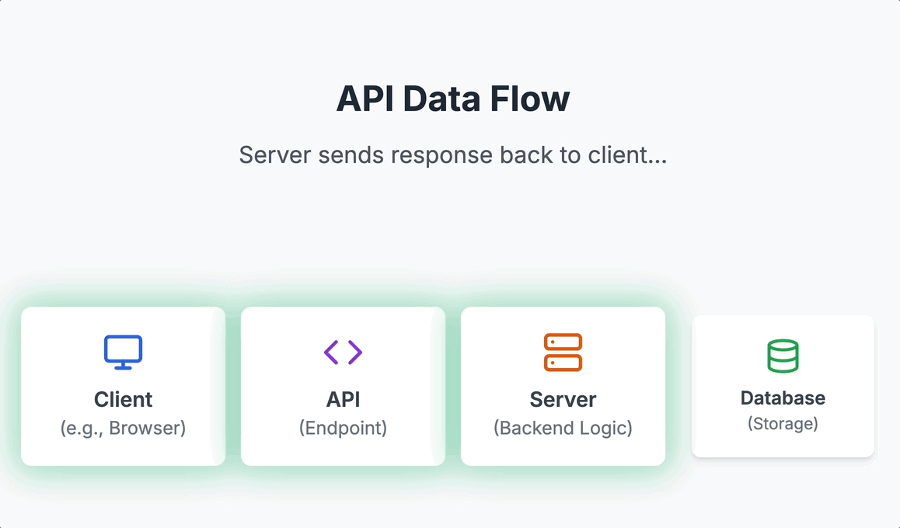
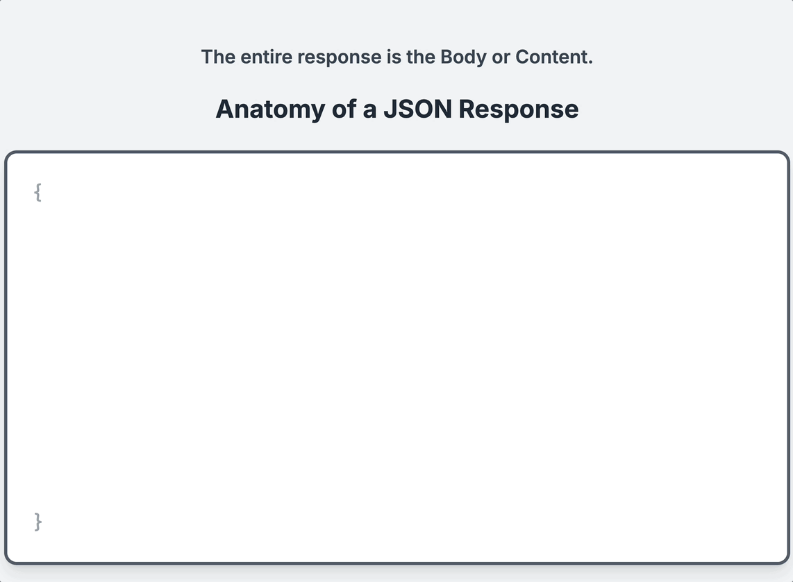

```{r setup, include=FALSE}
knitr::opts_chunk$set(eval = FALSE)
```

## Welcome & Orientation

Welcome to the **API Workshop**! Over the next two days (4 hours total), we will build a strong foundation in working with APIs — from understanding the data format they use, to making real requests and handling real responses.

**Workshop Structure:**

| Day | Time | Session | Focus |
|-----|------|---------|-------|
| Day 1 | 8:00–9:00 AM | Session 1 | JSON Fundamentals & Request/Response |
| Day 1 | 9:00–10:00 AM | Session 2 | CRUD, HTTP Methods, URL Anatomy & Dummy Server |
| Day 2 | 9:00–10:00 AM | Session 3 | Weather API — Setup, Current Weather, Geocoding |
| Day 2 | 10:00–11:00 AM | Session 4 | Historical Weather, Visualization & Wrap-Up |

**Tool Note:** We will be working in **Positron** throughout. You can follow along in RStudio, but Positron will give you a richer experience for this workshop.


---


## Part 1: What is an API?

**API** stands for **Application Programming Interface**. At its core, an API is a way for software to communicate with other software. In data science, we use APIs to programmatically request data from external servers — weather services, sports databases, social media platforms, and more.

Think of the **restaurant analogy**:

- **You** (the client) look at the menu and place an order.
- **The waiter** (the API) carries your order to the kitchen.
- **The kitchen** (the server/database) prepares your food.
- **The waiter** brings back your meal (the response).

The key insight: you never walk into the kitchen yourself. The API is the controlled interface that lets you interact with the data source.


#### ———————
### Q1. {.unnumbered}

**(Multiple Choice):** What is the primary utility of a web API for a data analyst?

a) To create visual websites for data projects.
b) To allow programmatic, repeatable, and direct access to live data from an external source.
c) To store large CSV files in the cloud.
d) To design the database structure for a server.

::: {.callout-tip collapse="true" title="Answer Q1"}
**b)** An API provides a structured way for a program (like an R script) to directly request and receive live data, making data acquisition automated and scalable.
:::
#### ———————

---


## Part 2: API Data Flow

Let's go deeper into the architecture. The flow of data through an API follows a predictable pattern:

**Request direction:**
Client (request) → API → Server → Database

**Response direction:**
Client ← API ← Server (response) ← Database

The animation below traces a single API call from start to finish. There are four components in the chain: the **Client** (your R script or browser), the **API** (the endpoint — the "front door"), the **Server** (backend logic that processes the request), and the **Database** (where the actual data lives). The request moves left to right; the response travels the same path in reverse.

{fig-alt="Animation showing API request traveling from Client through API Endpoint to Server and Database, then the response returning the same path in reverse"}

::: {.callout-note}
## Key Observations

- The **client** is your R script or browser — anything making the request.
- The **API** is the endpoint — the "front door" of the data service.
- The **server** processes the request and queries the **database**.
- The response travels back the same path.
- A client and server can exist on the same computer — this is common in local development.
:::


#### ———————
### Visual Check — API Data Flow. {.unnumbered}

**(Multiple Choice):** In the animation, the API sits between the Client and the Server. What best describes the API's role in this chain?

a) It stores the data permanently.
b) It acts as a gateway — receiving requests from the client and routing them to the server.
c) It runs the backend logic that queries the database.
d) It is the same as the database.

::: {.callout-tip collapse="true" title="Answer — Visual Check"}
**b)** The API is a **gateway** or controlled interface. It does not store data (that's the database) and it does not run the core business logic (that's the server). It is the stable "front door" that clients talk to, and it routes requests onward.
:::
#### ———————


#### ———————
### Q2. {.unnumbered}

**(Open-Ended):** Using the restaurant analogy where the API is a **waiter**, describe the step-by-step process of you (the **client**) successfully ordering and receiving a "current weather forecast" from the kitchen (the **server**).

::: {.callout-tip collapse="true" title="Answer Q2"}
I (the **client**) look at the menu (API documentation) and decide what I want. I then give my specific order for the "current weather forecast" to the **waiter** (the API). The waiter takes my request to the **kitchen** (the server), which has access to the fridge (the database). The kitchen prepares my order and gives the finished dish (the JSON data response) back to the waiter, who delivers it to my table.
:::
#### ———————


#### ———————
### Q3. {.unnumbered}

**(Multiple Choice — Callback to Q1):** In the restaurant analogy, the API documentation is most analogous to:

a) The kitchen equipment
b) The menu
c) The cash register
d) The table number

::: {.callout-tip collapse="true" title="Answer Q3"}
**b)** The menu. Just like a menu tells you what's available and how to order it, API documentation tells you what endpoints exist, what parameters you can send, and what responses to expect.
:::
#### ———————


---


## Part 3: Requests and Responses

Now let's zoom in on the two key actions: **requests** and **responses**.

### What is a Request?

The client sends a **request** asking for information. This request includes:

- A **URL** (e.g., with parameters like `?q=San+Luis+Obispo`)
- Possibly an **API key** (for authentication)
- A **method** (e.g., `GET` or `POST` — more on these in Session 2)

The request is constructed as a URL string. We'll dissect URL anatomy in the next session.

### What is a Response?

The server returns a **response** which contains:

- **Data** — the actual information you requested (temperature, artist name, forecast, etc.)
- **Metadata** — information *about* the response (timestamps, rate limits, etc.)
- **Status code** — tells you whether the request was successful (e.g., `200 OK`)

This information is traditionally provided in **JSON format**.


#### ———————
### Q4. {.unnumbered}

**(Open-Ended):** What is the fundamental difference between an API **request** and an API **response**?

::: {.callout-tip collapse="true" title="Answer Q4"}
A **request** is what you *send* to a server to ask for information. It's an outgoing message that includes the endpoint URL, your API key, and the specific parameters for your query. A **response** is what the server *sends back* to you. It's an incoming message containing the data you asked for (the body), a status code indicating success or failure, and other metadata.
:::
#### ———————


---


## Part 4: Anatomy of a JSON Response

Now let's focus on the **response** — specifically, what it looks like. API responses are almost always formatted as **JSON** (JavaScript Object Notation).

The animation below reveals the layers of a JSON response. The entire thing — everything the server sends back — is called the **Body** or **Content**. It is wrapped in curly braces `{ }`. Inside that body, the content is divided into three zones: the **data** (what you asked for), **metadata** (context about the response), and the **status code** (the success or failure signal). The animation builds these zones one at a time so you can see how they fit together.

{fig-alt="Animation revealing the anatomy of a JSON response: the full body opens as curly braces, then data, metadata, and status code zones are highlighted in sequence"}

::: {.callout-note}
## What is JSON?
When we send a request to an API, we get a response body, which includes the content — typically JSON — divided into:

- **Data**: what we actually wanted (temperature, city name, coordinates)
- **Metadata**: information about the response (timestamps, units, request ID)
- **Status code**: tells us if the request worked
:::


#### ———————
### Visual Check — JSON Response Anatomy. {.unnumbered}

**(Open-Ended):** The animation shows the entire response wrapped in `{ }`. When you call `resp_body_json()` in R to parse this response, what R data structure does that outer `{ }` (a JSON object) become, and how would you access the value for a key called `"temperature"` inside it?

::: {.callout-tip collapse="true" title="Answer — Visual Check"}
A JSON object (`{ }`) becomes a **named list** in R. To access the value for `"temperature"`, you would use `result$temperature` or `result[["temperature"]]`, where `result` is the variable holding the parsed response.
:::
#### ———————


### JSON Structure: Key-Value Pairs

JSON organizes data using **key-value pairs**. Here's a simple example:

```json
{
  "city": "San Luis Obispo",
  "temperature": 72,
  "units": "imperial",
  "conditions": "clear sky"
}
```

Key features of JSON:

- Data is wrapped in curly braces `{ }`
- Each entry is a `"key": value` pair
- Values can be strings, numbers, booleans, arrays, or **nested objects**
- Nested objects are JSON inside JSON — like a list within a list


### Nested JSON Example

```json
{
  "city": "San Luis Obispo",
  "coordinates": {
    "lat": 35.28,
    "lon": -120.66
  },
  "weather": {
    "main": "Clear",
    "temp": 72,
    "humidity": 45
  }
}
```

::: {.callout-important}
## Thinking in R Terms
In R, a JSON response becomes a **named list** — potentially containing other named lists inside it. This is what we mean by "nested." When we flatten it with `as.data.frame()`, nested keys become column names like `coordinates.lat` or `weather.temp`.
:::


#### ———————
### Q5. {.unnumbered}

**(Multiple Choice):** The JSON data format, commonly used in API responses, organizes information using what fundamental structure?

a) Rows and columns
b) A nested series of bullet points
c) Key-value pairs
d) Formatted paragraphs of text

::: {.callout-tip collapse="true" title="Answer Q5"}
**c)** JSON data is built on **key-value pairs** (e.g., `"city": "Chicago"`), where a "key" is a string and a "value" can be a string, number, boolean, array, or another object.
:::
#### ———————


#### ———————
### Q6. {.unnumbered}

**(Open-Ended — Callback to Q4):** Given the nested JSON example above, if you converted this to a data frame in R using `as.data.frame()`, what would the column name for the latitude value be?

::: {.callout-tip collapse="true" title="Answer Q6"}
The column name would be `coordinates.lat`. When R flattens a nested JSON structure into a data frame, it joins the nested key names with a period. So `coordinates` → `lat` becomes `coordinates.lat`.
:::
#### ———————


---


## Part 5: Status Codes

Status codes tell you what happened with your request. They are grouped by category:

| Range | Category | Meaning |
|-------|----------|---------|
| **1xx** | Informational | Request received, processing... |
| **2xx** | Success | Request was successful |
| **3xx** | Redirect | Resource moved to a different URL |
| **4xx** | Client Error | Something wrong with *your* request |
| **5xx** | Server Error | Something wrong on the *server's* end |

**The most important ones for data work:**

- **200 OK** — Success! You got your data.
- **401 Unauthorized** — Your API key is missing or invalid.
- **403 Forbidden** — You don't have permission to access this resource.
- **404 Not Found** — The endpoint or resource doesn't exist.
- **429 Too Many Requests** — You've hit the rate limit.
- **500 Internal Server Error** — The server broke; not your fault.

::: {.callout-note}
## Practical Tip
In most data API work, your goal is to get a **200** response. If you don't, the status code tells you *where* to look for the problem — your request (4xx) or their server (5xx).
:::


#### ———————
### Q7. {.unnumbered}

**(Discussion):** You write a script to get weather data, but it fails with a `404 Not Found` status code. Based on the 400-level error category, is it more likely that the weather company's server is broken, or that you made a mistake? What part of your request is the most likely source of the error?

::: {.callout-tip collapse="true" title="Answer Q7"}
A `404 Not Found` error is a **client-side** error (4xx), meaning the mistake is on my end. It is not a server error (5xx). The most likely problem is that the **URL endpoint** I used in my request is incorrect or misspelled — I've asked for a "page" that doesn't exist on the server.
:::
#### ———————


#### ———————
### Q8. {.unnumbered}

**(Multiple Choice — Callback to Q5):** If you receive a response with a status code of `200` and the body contains JSON, which of the following would you expect to find in that response?

a) An error message explaining what went wrong
b) Key-value pairs containing the data you requested
c) A redirect URL to a different API
d) An empty response with no content

::: {.callout-tip collapse="true" title="Answer Q8"}
**b)** A `200 OK` status means success, and the JSON body will contain the key-value pairs with the data you requested — temperature, coordinates, city name, etc.
:::
#### ———————


#### ———————
### Q9. {.unnumbered}

**(Open-Ended):** You receive a `401 Unauthorized` error when trying to access weather data. You've double-checked the URL and it's correct. What is the most likely cause, and how would you fix it?

::: {.callout-tip collapse="true" title="Answer Q9"}
A `401 Unauthorized` error means your **API key** is missing, invalid, or expired. The fix is to check that you've properly loaded your API key (e.g., from your `.Renviron` file), that the key is still active on the provider's website, and that you're passing it correctly in the request URL or headers.
:::
#### ———————


---


## Session 1 Recap

In this session, we covered the **conceptual foundation** for working with APIs:

1. **What an API is** — a controlled interface for software-to-software communication
2. **API data flow** — Client → API → Server → Database (and back)
3. **Requests vs. Responses** — what you send vs. what you get back
4. **JSON format** — key-value pairs, nesting, and how it maps to R data structures
5. **Status codes** — how to diagnose what happened with your request

**Up next in Session 2:** We'll learn about CRUD operations, HTTP methods (GET vs. POST), URL anatomy, and make our first requests to a dummy server!
